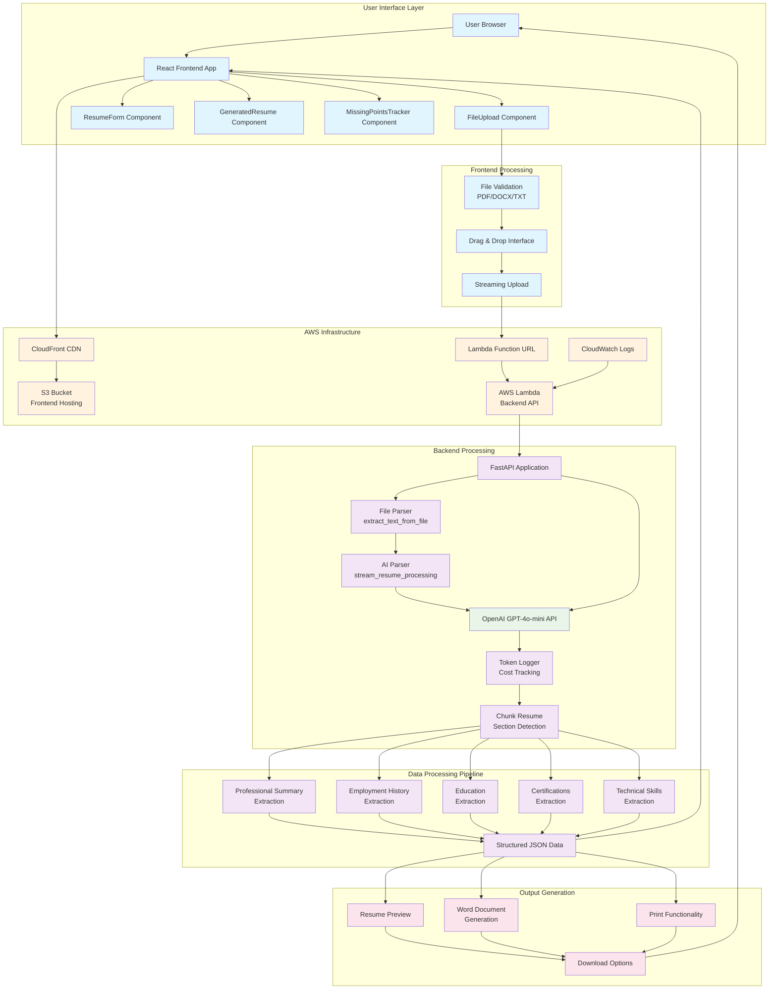
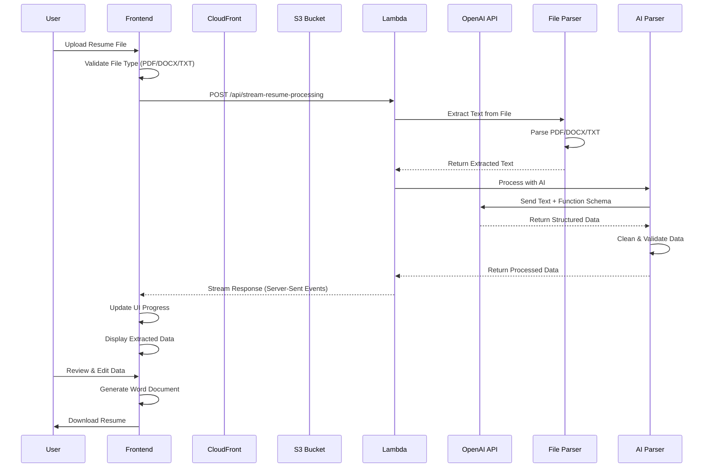
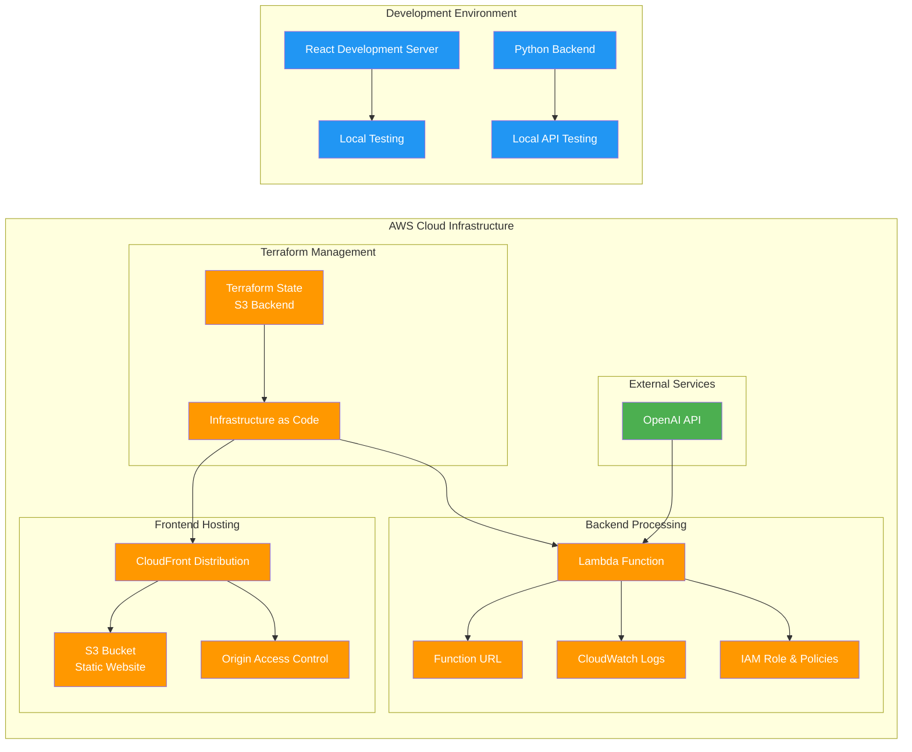
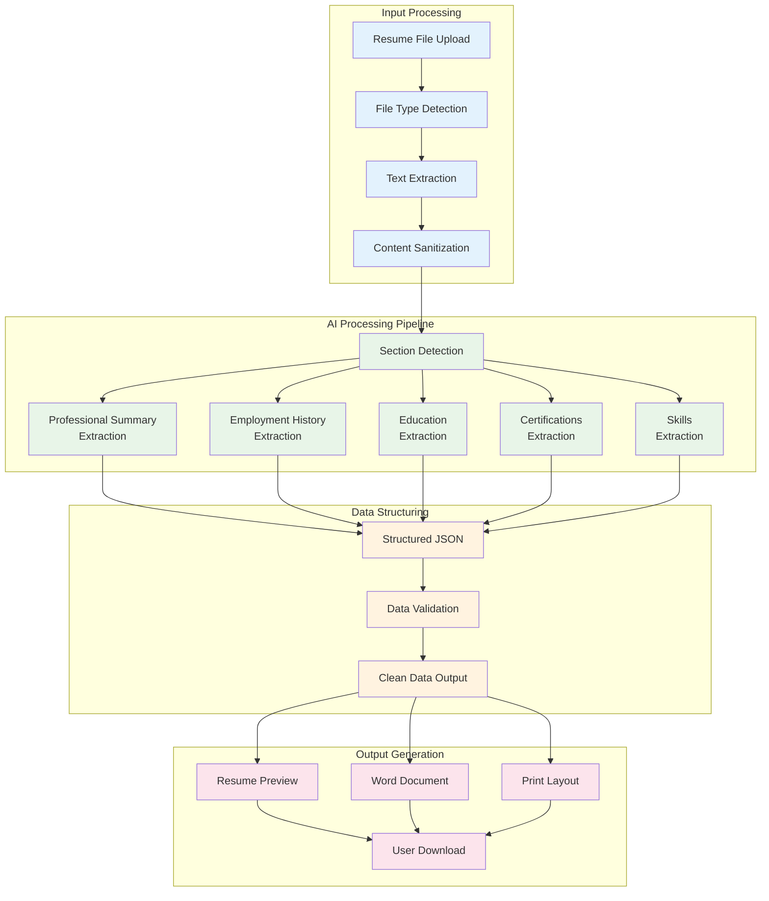

# Resume Builder Project Flow Diagram

## System Architecture Overview



## Detailed Component Flow



## Infrastructure Components



## Data Flow Architecture



## Key Features & Technologies

### Frontend (React)
- **FileUpload**: Drag & drop interface with file validation
- **ResumeForm**: Comprehensive editing interface for all resume sections
- **GeneratedResume**: Preview and download functionality
- **MissingPointsTracker**: Quality assurance for AI extraction
- **Streaming**: Real-time progress updates during AI processing

### Backend (FastAPI + Python)
- **File Parser**: Supports PDF, DOCX, and TXT files
- **AI Parser**: OpenAI GPT-4o-mini integration with function calling
- **Token Logger**: Cost tracking and usage analytics
- **Chunk Resume**: Intelligent section detection and parsing
- **Streaming Response**: Server-sent events for real-time updates

### Infrastructure (AWS + Terraform)
- **S3**: Static website hosting for frontend
- **CloudFront**: CDN for global content delivery
- **Lambda**: Serverless backend processing
- **Function URL**: Direct API access without API Gateway
- **CloudWatch**: Logging and monitoring
- **Terraform**: Infrastructure as Code management

### AI Processing
- **OpenAI GPT-4o-mini**: Cost-effective AI processing
- **Function Calling**: Structured data extraction
- **Cache Bypass**: Ensures fresh AI responses
- **Token Optimization**: Efficient prompt engineering
- **Error Handling**: Robust fallback mechanisms

## Project Structure Summary

```
ob-resume-builder-test/
├── frontend/                 # React application
│   ├── src/components/      # UI components
│   ├── public/              # Static assets
│   └── package.json         # Dependencies
├── backend/                 # Python FastAPI backend
│   ├── utils/               # Processing utilities
│   ├── main.py              # FastAPI application
│   └── lambda_handler.py    # AWS Lambda wrapper
├── terraform/               # Infrastructure as Code
│   ├── modules/             # Reusable components
│   └── main.tf              # Main configuration
└── standalone-resume-builder/ # Dummy directory (ignored)
```

This resume builder project demonstrates a modern, scalable architecture combining React frontend, Python backend, AI processing, and AWS cloud infrastructure to provide an intelligent resume parsing and generation service.
